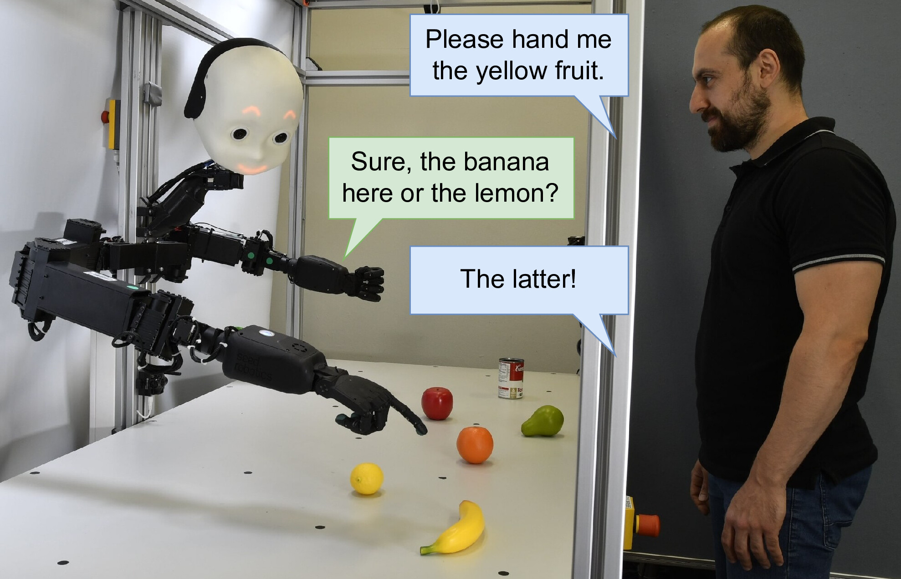

# When Robots Get Chatty

Code release corresponding to the **open access** ICANN 2024 paper (**Best Paper Award**):

Philipp Allgeuer, Hassan Ali, and Stefan Wermter: *When Robots Get Chatty: Grounding Multimodal Human-Robot Conversation and Collaboration*



Please refer to `nicol_demos/launch` for launch files, and `nicol_demos/scripts/chat_demo.py` for the main chatty robots ROS node. The codebase contains a completely generic implementation of a ROS action server/client that supports multiple parallel requests. The speech ASR module is built on top of this. Both the speech ASR and TTS (i.e. speech server) are implemented as completely generic ROS nodes that can be reused for any other projects. The speech server is implemented using auto-sentence splitting and pre-caching, is very efficient/low-latency, and allows for complex use-cases including speech part re-use.

**Links:**

* Video: [https://youtu.be/A2WLEuiM3-s](https://youtu.be/A2WLEuiM3-s)
* Paper (Springer, Open Access): [https://link.springer.com/chapter/10.1007/978-3-031-72341-4_21](https://link.springer.com/chapter/10.1007/978-3-031-72341-4_21)
* Paper (arXiv): [https://arxiv.org/abs/2407.00518](https://arxiv.org/abs/2407.00518)
* NICOL Robot: [https://www.inf.uni-hamburg.de/en/inst/ab/wtm/research/neurobotics/nicol.html](https://www.inf.uni-hamburg.de/en/inst/ab/wtm/research/neurobotics/nicol.html)

## Citation

If you use this project in your research, please cite it as follows:

```bibtex
@InProceedings{chatty_robots_2024, 
    author =  {Allgeuer, Philipp and Ali, Hassan and Wermter, Stefan},
    title = {When Robots Get Chatty: {G}rounding Multimodal Human-Robot Conversation and Collaboration}, 
    booktitle = {Proceedings of the International Conference on Artificial Neural Networks},
    pages = {306--321},
    year = {2024},
    month = {Sep},
    doi = {10.1007/978-3-031-72341-4_21}, 
}
```
